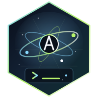

<p align="center">
  
</p>

<p align="center">
  <a href="https://hex.pm/packages/antigravity_cli_sdk"></a>
  <a href="https://hexdocs.pm/antigravity_cli_sdk"></a>
  <a href="LICENSE"></a>
  <a href="https://github.com/nshkrdotcom/antigravity_cli_sdk/actions"></a>
</p>

# AntigravityCliSdk

`AntigravityCliSdk` is the Elixir SDK for the Google Antigravity CLI (`agy`).
It gives Elixir applications a typed streaming API, a simple synchronous
`run/2`, governed launch checks, and the runtime module consumed by
`agent_session_manager` for the `:antigravity` SDK lane.

The SDK does not reimplement subprocess handling. It uses
`cli_subprocess_core`, the same core runtime that powers ASM's common
Antigravity lane.

## Installation

Sibling checkout during local development:

```elixir
def deps do
  [
    {:antigravity_cli_sdk, path: "../antigravity_cli_sdk"}
  ]
end
```

Hex dependency after publish:

```elixir
def deps do
  [
    {:antigravity_cli_sdk, "~> 0.1.0", organization: "nshkrdotcom"}
  ]
end
```

## Quickstart

```elixir
{:ok, text} =
  AntigravityCliSdk.run("Reply with exactly: OK", %AntigravityCliSdk.Options{
    dangerously_skip_permissions: true
  })
```

For streaming:

```elixir
"Explain OTP in one sentence."
|> AntigravityCliSdk.execute(%AntigravityCliSdk.Options{})
|> Enum.each(fn
  %AntigravityCliSdk.Types.MessageEvent{content: text} -> IO.write(text)
  %AntigravityCliSdk.Types.ResultEvent{} -> :ok
  %AntigravityCliSdk.Types.ErrorEvent{} = error -> IO.inspect(error)
end)
```

## Configuration

Runtime configuration is explicit:

- `ANTIGRAVITY_CLI_PATH` is translated by `config/runtime.exs` into the app
  config key `:cli_path`.
- `ANTIGRAVITY_MODEL` becomes the app config key `:model`.
- `ANTIGRAVITY_LOG_FILE` becomes the app config key `:log_file`.
- `%AntigravityCliSdk.Options{api_key: value}` becomes
  `ANTIGRAVITY_API_KEY` in the child process environment.

Library modules read application config, not the parent OS environment.

## Live Example

```bash
mix run examples/simple_stream.exs
```

The example uses the real `agy` binary through `cli_subprocess_core`.
Run the full SDK-owned suite with:

```bash
~/scripts/with_bash_secrets bash examples/run_all.sh
```

See [Examples](examples/README.md) for the full inventory. ASM provider
examples live in `agent_session_manager/examples`.

## Documentation

- [Getting Started](guides/getting-started.md)
- [Options](guides/options.md)
- [Streaming](guides/streaming.md)
- [Sessions](guides/sessions.md)
- [Authentication](guides/authentication.md)
- [Architecture](guides/architecture.md)
- [Examples](examples/README.md)
