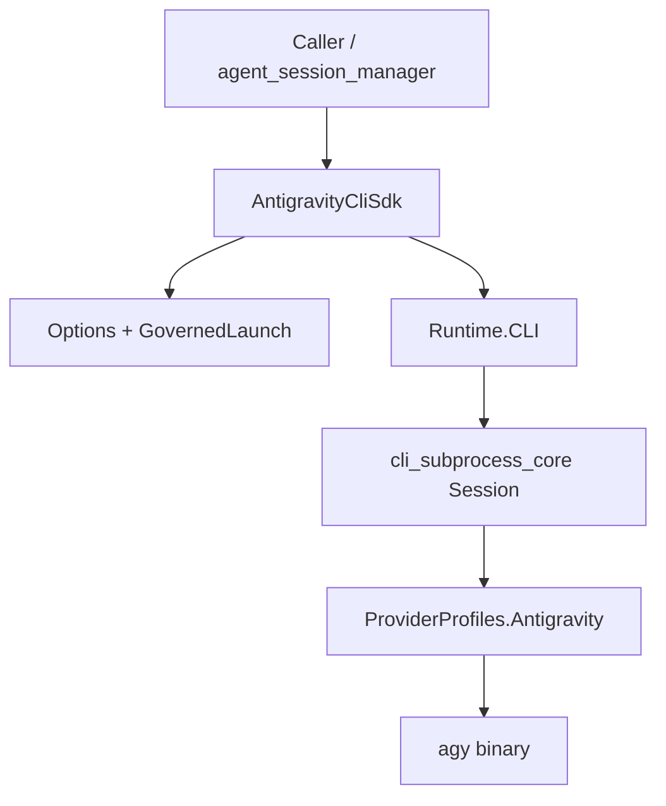

# Architecture

`AntigravityCliSdk` is not a second subprocess runtime. It is a typed SDK layer
over `cli_subprocess_core`:

1. `Options` validates caller input and resolves the core model payload.
2. `ArgBuilder` renders `agy --print <prompt>` and supported flags.
3. `Runtime.CLI.Profile` delegates decode/exit handling to the core
   Antigravity provider profile.
4. `Stream` converts normalized core events into SDK event structs.
5. `agent_session_manager` can use `AntigravityCliSdk.Runtime.CLI` as the SDK
   runtime for the `:antigravity` provider.

The core lane and SDK lane intentionally share the same parser behavior:
Antigravity stdout is plain text, non-empty lines become assistant deltas, and
the SDK accumulates those deltas into the final result event.
